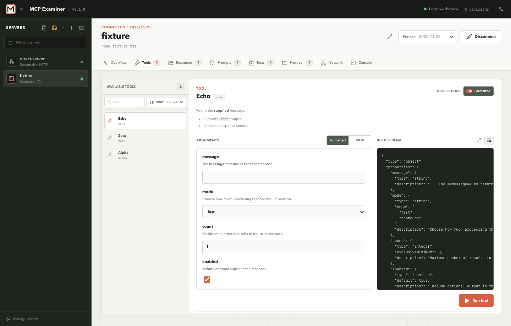

# MCP Examiner documentation

MCP Examiner is a native workbench for inspecting and testing Model Context Protocol servers. Use the desktop app when you want to explore a server interactively; use the CLI when the same checks need to run in scripts or CI.



## Start here

| Guide | Use it when you want to... |
| --- | --- |
| [Install and first connection](getting-started.md) | Install the project, launch the desktop app, import a server, and make the first connection. |
| [Workbench guide](workbench.md) | Understand the server rail, inspector tabs, manual calls, and saved configuration. |
| [Automated tests and reports](automation.md) | Write or generate test sets, run assertions, and save HTML/YAML evidence. |
| [OAuth and secret handling](oauth.md) | Configure remote authorization, resolve inputs, and understand redaction and keychain storage. |
| [Architecture and development](architecture.md) | Navigate the Rust/React workspace, run checks, and work on fixtures or releases. |
| [MCP test set format](suite-format.md) | Read the complete call and expectation syntax. |

## Product model

MCP Examiner keeps three things separate:

1. A **server profile** describes how to start or reach a server, which protocol revision to negotiate, and where its configuration came from.
2. A **connection snapshot** records the negotiated server identity, capabilities, and discovered tools, resources, and prompts.
3. A **test set** describes ordered calls and expectations that can be run against a fresh session.

This makes a profile useful for interactive investigation and repeatable automation without asking the test file to contain transport or credential details.

## Supported MCP revisions

The current build advertises these protocol revisions:

```text
2024-11-05
2025-03-26
2025-06-18
2025-11-25
2026-07-28
```

The app can auto-negotiate or pin a specific revision per server profile. The exact set is also available from the CLI:

```bash
npm run cli -- versions
```

## Screenshots

The guide uses real UI captures from the Playwright fixture workspace:

- [Importing a configuration](workbench.md#import-a-configuration) shows the JSON editor and format selector.
- [Calling a tool](workbench.md#tools) shows schema-aware arguments beside the raw input schema.
- [Inspecting network observations](workbench.md#network-and-protocol) shows redacted request and response evidence.