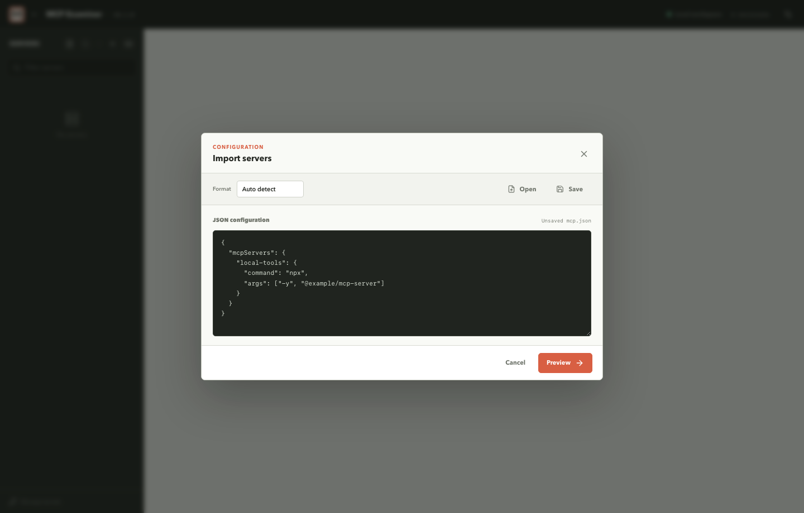
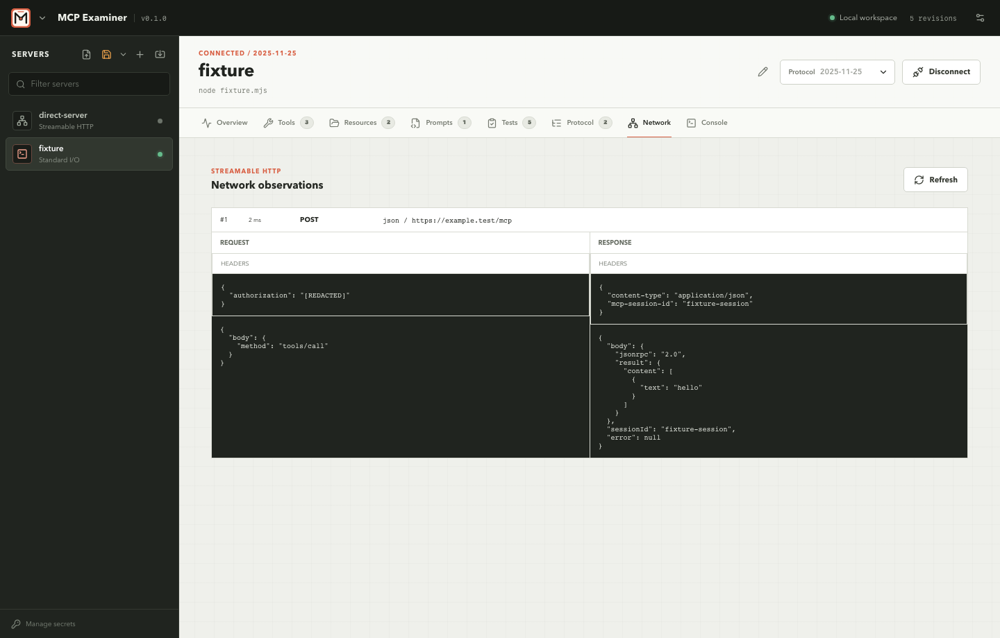

# Workbench guide

After a profile is connected, MCP Examiner keeps the server identity and its discovered primitives in a single workspace. The header shows connection state, negotiated protocol revision, endpoint or command, protocol selection, and the connect/disconnect action. The tabs below it are scoped to the selected server.

## Import a configuration

The import editor accepts JSON and can normalize several common MCP client formats. Use **Format** when auto-detection is not enough, then select **Preview** to inspect the profiles and diagnostics before committing them.

Imported profiles are normalized into the app's internal format. Saving from the server rail writes the live normalized list as an MCP JSON configuration. The active path is shown in the title bar and recent configuration paths are available from the title bar menu.

## Add or edit a profile

The structured editor supports these transport choices:

| Transport | Configuration |
| --- | --- |
| Standard I/O | Command, one argument per line, working directory, environment file, and environment entries. |
| Streamable HTTP | URL, headers, optional OAuth settings. |
| HTTP + SSE | URL, headers, optional OAuth settings. |
| Auto-detect | Remote URL and headers with automatic transport selection. |
| WebSocket | URL and headers. |

All profiles also have a protocol mode. **Auto negotiate** is the default; the dropdown can pin one of the revisions reported by `mcp-examiner versions`.

Secret environment or header values can be marked for managed storage. The value is written to the OS keychain and the profile keeps only a reference. See [OAuth and secret handling](oauth.md) for the storage and redaction rules.

## Overview

Overview separates three useful facts:

- **Server identity**: implementation name, reported version, and negotiated MCP revision after connection.
- **Connection profile**: normalized transport and endpoint or command.
- **OAuth discovery**: metadata source, authorization server, registration options, and advertised scopes when an OAuth flow was observed.

The activity section shows the latest retained semantic protocol events. The full event payloads remain available in the Protocol tab.

## Tools

Tools are listed on the left and can be filtered or sorted. Selecting a tool shows its description, generated argument form, and input schema. The form handles common JSON Schema fields and can be switched to raw JSON when a server uses a schema that needs manual editing.

Choose **Run tool** to send a manual call. Returned data is rendered with formatted and JSON views where appropriate. Calls update the retained protocol history and can be used as the basis for generated test calls in the Tests tab.

## Resources and prompts

Resources and resource templates use the same two-pane pattern. Select a resource, edit its URI when needed, and choose **Read resource**. Resource results are rendered as structured data or as an MCP Apps preview when the response advertises an embedded UI resource.

Prompts expose the server's prompt arguments as a form. Choose **Get prompt** to inspect the returned messages and rendered content.

## Network and Protocol

The **Network** tab is for Streamable HTTP observations. Each observation can be expanded to inspect redacted request and response headers, bodies, response kind, session id, and errors.

The **Protocol** tab is transport-independent. It lists ordered semantic lifecycle, request, response, and internal events with elapsed time and redacted payloads. It is the best place to understand an MCP exchange without reading raw process logs.

The **Console** tab keeps the current connection error and related runtime messages visible. A failed connection can be retried after correcting the profile, resolving an input, or completing OAuth.

## Save configuration

Use the server rail save button to write the current normalized profiles. **Save as** chooses a new JSON path. A server profile is marked dirty when it is added, edited, or its protocol selection changes; saving clears the dirty state.

The app does not write resolved secret values into configuration files. Imported credential-bearing values are normalized and redacted where they leave the secure runtime boundary.